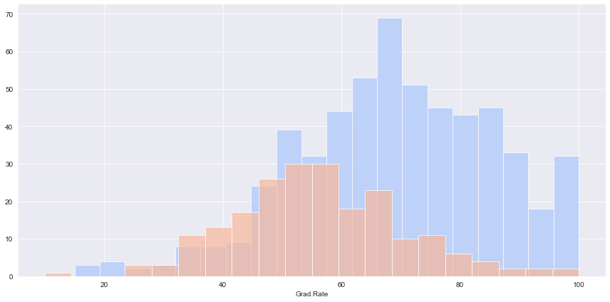

# K Means Clustering - Clustering Univerisities as Public x Private

In this example, I'm using data from 777 American Universities classified as either 
The objective is to use a K Means Cluster algorithm to cluster universities as Private or Public.

The attributes in this dataset are:
- Private A factor with levels No and Yes indicating private or public university
- Apps Number of applications received
- Accept Number of applications accepted
- Enroll Number of new students enrolled
- Top10perc Pct. new students from top 10% of H.S. class
- Top25perc Pct. new students from top 25% of H.S. class
- F.Undergrad Number of fulltime undergraduates
- P.Undergrad Number of parttime undergraduates
- Outstate Out-of-state tuition
- Room.Board Room and board costs
- Books Estimated book costs
- Personal Estimated personal spending
- PhD Pct. of faculty with Ph.D.’s
- Terminal Pct. of faculty with terminal degree
- S.F.Ratio Student/faculty ratio
- perc.alumni Pct. alumni who donate
- Expend Instructional expenditure per student
- Grad.Rate Graduation rate

# Exploratory Data Analysis

## What's the relationship between Rooam+Board costs, Graduation Rate and if an University is private or public?


## What's the relationship between Outstate tuition and Number of fulltime undegraduates?


## What's the graduation rates for Public and Private universities?




# Working on the model

Here I'm using the [K Means algorithm](https://scikit-learn.org/stable/modules/generated/sklearn.cluster.KMeans.html) from the scikitlearn library.

I'm considering K=2 since this is a binary option.

I'm "dropping" the label column ('Private') and running the model with the other attributes.

# How good the model is?
 
For a K Means Cluster algorithm, there's no perfect way to measure its efficiency.

In this particular case, we can check its classification report:

```
              precision    recall  f1-score   support

           0       0.21      0.65      0.31       212
           1       0.31      0.06      0.10       565

    accuracy                           0.22       777
   macro avg       0.26      0.36      0.21       777
weighted avg       0.29      0.22      0.16       777
```

## Libraries Used

| Name | Library |
| ------ | ------ |
| Pandas | https://pandas.pydata.org/ |
| Matplotlib | https://matplotlib.org/ |
| Seaborn | https://seaborn.pydata.org/ |
| SciKitLearn | https://scikit-learn.org/stable/ |